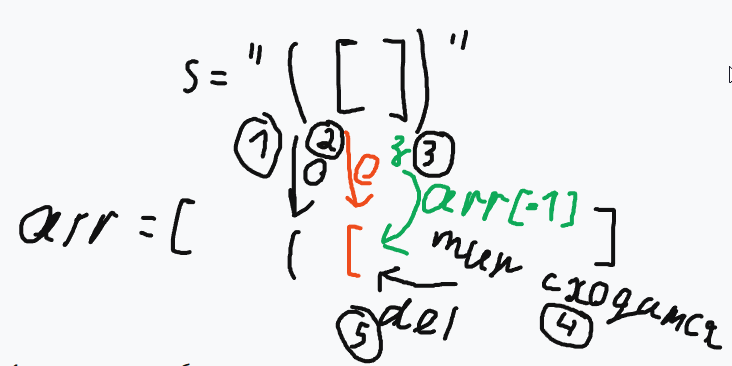

# 20. Valid Parentheses

https://leetcode.com/problems/valid-parentheses/description/

## Description
Given a string s containing just the characters '(', ')', '{', '}', '[' and ']', determine if the input string is valid.

An input string is valid if:

1. Open brackets must be closed by the same type of brackets.
2. Open brackets must be closed in the correct order.
3. Every close bracket has a corresponding open bracket of the same type.
 

Example 1:
> Input: s = "()"  
> Output: true

Example 2:
> Input: s = "()[]{}"  
> Output: true

Example 3:
> Input: s = "(]"  
> Output: false

Example 4:
> Input: s = "([])"  
> Output: true

Example 5:
> Input: s = "([)]"  
> Output: false

 

Constraints:
- 1 <= s.length <= 104
- s consists of parentheses only '()[]{}'.

---

## Сбор информации
### Перескажите своими словами
Нужно определить правильно ли входная строка содержит скобки. То есть все открывающиеся скобки должны иметь закрывающуюся скобку соответственного типа и не должно быть пересечений типа "({)}". 

### Какие данные у вас есть?
строка состоящая из скобок

### Что нужно найти?
определить соответствует ли строка правилам

### Какие ограничения?
есть только `{}`
1 <= s.length <= 10^4

### Уточняйте. Так много и часто, как возможно, пока не наступит момент, что вопросов больше нет. (Как? Почему? Где? Зачем? А здесь? Что, если?)
- куда девать считанные скобки? в отдельную переменную записывать?
- как сделать за один проход O(n)?
- что делать когда у нас появляется 2 открывающаяся скобка? что делать с 1 открытой скобкой?

---

## Гипотезы
### Какие подобные проблемы я решал?
не было подобных

### Переберите все возможные техники и алгоритмы, которые знаете
не знал никаких специальных техник. Решение использовать массив(стек) для открытых скобок пришло само. Использовал стек для оптимизации по времени O(n)

### Разделите условия на составные части
1. считываем скобку
2. Проверяем открытая или закрытая
- Если закрытая, то проверяем тип, если сходится то идем дальше, если нет то `false`
- Если открытая, то заносим в массив в конец(push)
### Визуализация проблемы

### Что можно было бы улучшить (После решения задачи)
использовать двусторонний mapper и через `Object.keys/values` обращаться к нужным скобкам