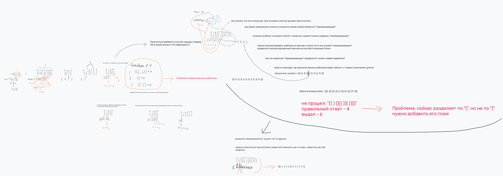

# 32. Longest Valid Parentheses

https://leetcode.com/problems/longest-valid-parentheses/description/

## Description
Given a string containing just the characters '(' and ')', return the length of the longest valid (well-formed) parentheses substring.


Example 1:
> Input: s = "(()"
> Output: 2
> Explanation: The longest valid parentheses substring is "()".

Example 2:
> Input: s = ")()())"
> Output: 4
> Explanation: The longest valid parentheses substring is "()()".

Example 3:
> Input: s = ""
> Output: 0
 

Constraints:
- 0 <= s.length <= 3 * 104
- s[i] is '(', or ')'.

---

## Сбор информации
### Перескажите своими словами
нужно найти самую длинную подстроку из правильно составленных скобок. 
Правильные скобки - `(())()` = 6
Неправильно - `)(` = 0

### Какие данные у вас есть?
строка состоящая из скобок

### Какие ограничения?
есть только `()`
0 <= s.length <= 3 * 10^4


---

## Гипотезы
### Какие подобные проблемы я решал?
предыдущая проблема, где нужно было проверить правильность составленных скобок в строке
там использовал стек и обычный проход по строке

НО не решал задачи поиск самых длинных подстрок

### Ход мыслей
На уме пока что только brute force - использовать 2 цикла и пройти по всем возможным варианта. Сложность O(n^2) ps: Сложность O(n^3) из за проверки валидности
Такой способ легко написать, но естественно он по времени не оптимизирован

добавил ограничение для 1 цикла, что строка должна начинаться с открытой скобки.

код:
``` js
const mapper = {
    '(': ')',
    '[': ']',
    '{': '}',
};

const isValid = (s) => {
    if (s.length === 1) return false;

    const openBrackets = []; // '{' | '[' | '('

    for (let bracket of s) {
        if (Object.keys(mapper).includes(bracket)) {
            openBrackets.push(bracket);
        } else {
            const lastOpenedBracket = openBrackets.at(-1);

            if (mapper[lastOpenedBracket] !== bracket) {
                return false;
            }

            openBrackets.splice(openBrackets.length - 1, 1);
        }
    }

    if (openBrackets.length !== 0) return false;

    return true;
};

/**
 * @param {string} s
 * @return {number}
 */
var longestValidParentheses = function (s) {
    let longestSubstring = 0;

    for (let i = 0; i < s.length; i++) {
        if (s[i] === ')') continue;
        let str = s[i];

        for (let j = i + 1; j < s.length; j++) {
            str += s[j];

            if (isValid(str) && str.length > longestSubstring) longestSubstring = str.length;
        }
    }

    return longestSubstring;
};

const start = process.hrtime.bigint();

console.log(longestValidParentheses(')(()())(()())('))

const end = process.hrtime.bigint();
console.log(`Время: ${(end - start) / 1000000n} ms`);
```

как и ожидалось `Time Limit Exceeded` в leetCode.

попробовал добавить дополнительную проверку на нечетность в функции isValid. если нечетно то сразу не валидно.
скорость возросла в 2 раза для строки в длину 1700 скобок

подумаю над оптимизированным алгоритмом

---
решение v2
попросил подсказку у нейросети - сказала, обратить внимание на индексы скобок в строке.
вернусь к идее из предыдущего задания: взять стек и заполнять его открытыми скобками. При встрече закрытой делать `pop` из стека. Но со сравнением предыдущей таской заполнять стек индексами как подсказала нейросеть и при встрече с закрытой скобкой происходит вычисление разницы. Это и есть длина.
НО есть проблема в этой строке `)()())` и в `(()()`. Новый алгоритм не учитывает подряд идущие паттерны закрывающиеся в "ноль". Ответ неверный

Как покрыть данный случай?

попробовал создать дополнительный массив c длинов "паттерны" закрывающихся в 0 `widthOfTemplates`. Он будет иметь длину строки и заполнен сначала нулями. Когда заканчивается "шаблон" в новый массив заносится длина этого шаблона на индекс закрытой скобки. В итоге массив `[0, 0, 2, 0, 2, 0, 0, 2, 0, 2, 0, 2]`.

получается фигня какая то, слишком усложняется решение дальнейшее

``` js
/**
 * @param {string} s
 * @return {number}
 */
var longestValidParentheses = function (s) {
    if (s.length === 1) return 0

    let longestSubstring = 0;

    const stackIndexes = [];
    const widthOfTemplates = new Array(s.length).fill(0);

    for (let i = 0; i < s.length; i++) {
        if (s[i] === '(') {
            stackIndexes.push(i);
        } else if(stackIndexes.length !== 0) {
            const lastIndex = stackIndexes.pop(stackIndexes.length);

            const width = i - lastIndex + 1;

            widthOfTemplates[i] = width;

            if (longestSubstring < width) longestSubstring = width
        }
    }

    return Math.max(getMaxSumFromArray(widthOfTemplates, stackIndexes), longestSubstring);
};

const start = process.hrtime.bigint();

console.log(longestValidParentheses('(()()(()()()'));

const end = process.hrtime.bigint();
console.log(`Время: ${(end - start) / 1000000n} ms`);
```

---
решение v3
надо попробовать записывать не длины "паттернов", а просто метки 1 и 0. Он также заполнен "0" и имеет длину строки. Как только нашли закрытую скобку для открытой - помечаем в массиве единице открытую и закрытую скобку по имеющимся в данный момент индексам

например для `())(()())(` получится `[1, 1, 0, 1, 1, 1, 1, 1, 1, 0]`. Остается посчитать длину подряд идущих единиц

итоговое решение через маркеры получилось O(n) по времени 
``` js
/**
 * @param {string} s
 * @return {number}
 */
var longestValidParentheses = function (s) {
    if (s.length <= 1) return 0;

    const stackIndexes = [];
    const validMarkers = new Array(s.length).fill(0);

    for (let i = 0; i < s.length; i++) {
        if (s[i] === '(') {
            stackIndexes.push(i);
        } else if (stackIndexes.length !== 0) {
            const openIdx = stackIndexes.pop();
            
            validMarkers[openIdx] = 1;
            validMarkers[i] = 1;
        }
    }

    let maxLen = 0;
    let currentLen = 0;
    
    for (let mark of validMarkers) {
        if (mark === 1) {
            currentLen++;
            maxLen = Math.max(maxLen, currentLen);
        } else {
            currentLen = 0;
        }
    }

    return maxLen;
};

const start = process.hrtime.bigint();

console.log(longestValidParentheses('(()()(()()()'));

const end = process.hrtime.bigint();
console.log(`Время: ${(end - start) / 1000000n} ms`);
```

решение заняло 2 дня раздумий

